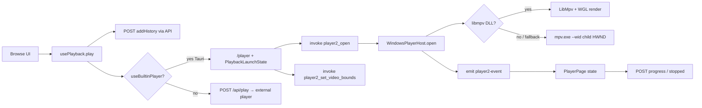

# Pitflix media player — end-to-end review document

This file is a **single, self-contained overview** of how the built-in media player works in the Pitflix desktop app (Tauri + React + Windows native host + mpv). Use it for external review (e.g. ChatGPT) without needing the rest of the repo.

For **mpv bundling, licensing, and IPC pipe quirks**, see [`PLAYER_ARCHITECTURE.md`](./PLAYER_ARCHITECTURE.md) (some paths there refer to an older `mpv.rs` layout; the live code lives under `src-tauri/src/player/`). For **why “Path B” replaced WebView-embedded video**, see [`MEDIA_PLAYER_PATH_B.md`](./MEDIA_PLAYER_PATH_B.md).

---

## 1. Goals and ownership

- **mpv** (or **libmpv** when `libmpv-2.dll` is present) is the **decode/render engine**. It does not own library metadata, series structure, or persisted watch state.
- **React** (`/player` route) owns **UI, resume prompts, progress reporting, next/previous episode navigation**, and calls the **Pitflix.API** HTTP API for history.
- **Rust (Tauri backend)** owns **native window hierarchy**, **embedding the video surface** under the main window, **command dispatch** to mpv/libmpv, and **emitting playback events** to the webview.

---

## 2. User journey (happy path)

1. User clicks Play. `usePlayback` (`src/hooks/usePlayback.ts`) creates/updates **watch history** via `addHistory`, loads settings, and checks **`useBuiltinPlayer`** (SQLite via `/api/settings`, default on in Tauri).
2. If built-in player is on: **navigate** to `/player` with **`PlaybackLaunchState`** (`src/types/playback.ts`): `historyId`, `filePath`, title, poster, media type, optional resume seconds, optional library IDs for series navigation.
3. **`PlayerPage`** (`src/pages/PlayerPage.tsx`) optionally shows a **resume** dialog if `resumeSeconds > 60`, then calls **`player2_open`** with path and optional `start_seconds`.
4. React keeps the native video rectangle aligned with a **transparent DOM region** by calling **`player2_set_video_bounds`** with `getBoundingClientRect()` (logical CSS px); Rust converts with **main window DPI** and **`SetWindowPos`** on the video child `HWND`.
5. Rust streams **typed events** (`player2-event`: `State`, `Tracks`, `Error`) and optional **`player-ipc-error`**. React binds controls to **`player2_send`** with a **`PlayerCommand`** JSON envelope.
6. **Progress**: periodic `POST /api/history/{id}/progress` (~4s), flush on **ended**, and **`historyStopped`** on unmount/navigation; series use **`GET /api/series/.../next-episode`** and **previous** for Prev/Next.

---

## 3. Frontend entry and routing

| Piece | Role |
|--------|------|
| `usePlayback.ts` | Decides built-in vs `POST /play`; builds `PlaybackLaunchState`; for external player registers **window focus** listener to call `historyStopped`. |
| `PlayerPage.tsx` | Resume UI, `player2_open` / `player2_close`, **`player2_set_video_bounds`** sync (ResizeObserver, scroll, fullscreen, Tauri resize/scale, poll), listens **`player2-event`** / **`player2-shortcut`**, posts history, next/prev episode via **`addHistory` + replace navigation** to `/player`. |
| `PlaybackLaunchState` | All router state needed for one playback session (ids, paths, resume). |

**Keyboard (document-level on `/player`)**: Space pause, arrows seek, F fullscreen, M mute, S subs, N/P next/prev episode, Esc exit (or exit fullscreen first). Native window may also emit shortcuts as **`player2-shortcut`** (e.g. next, previous, escape, toggle-fullscreen) for parity with Path B native handling.

---

## 4. Tauri command surface (Path B)

Registered in `src-tauri/src/lib.rs`, implemented in `src-tauri/src/player/tauri_commands.rs`, permission set in `src-tauri/permissions/allow-player.json`.

| Command | Purpose |
|---------|---------|
| `player2_open` | `{ payload: { path, start_seconds? } }` — opens session, creates native video child, starts libmpv or `mpv.exe`. |
| `player2_send` | JSON **`PlayerCommand`** (tagged union, see below). |
| `player2_close` | Tears down session, destroys child window, kills external mpv if used, restores focus. |
| `player2_set_video_bounds` | `{ x, y, width, height }` logical pixels relative to layout; positions video `HWND`. |

**`PlayerCommand`** (`src-tauri/src/player/commands.rs`): `Play`, `Pause`, `SetPaused(bool)`, `SeekRelative`, `SeekAbsolute`, `SetMute`, `SetVolume`, `SetSubVisibility`, `SetSid`, `SetAid`, `Stop`. These are translated to **mpv JSON IPC**-style commands in `windows_host.rs` (`cmd_to_mpv_ipc`).

---

## 5. Rust module layout

| Module | Responsibility |
|--------|------------------|
| `player/mod.rs` | `PlayerHost` / `PlayerHostState` — thin wrapper; Windows delegates to `windows_host`. |
| `player/windows_host.rs` | **Windows**: create **child video `HWND`** under Tauri **main** window; choose **LibMpv** vs **external mpv**; IPC reader thread for external mpv; **`player2-event`** emission; **click-through** overlay stacking so WebView stays interactive; shortcut routing. |
| `player/libmpv.rs` | Dynamic load **`libmpv-2.dll`**, `MpvClient`, command application, property observation hooks. |
| `player/mpv_gl_win.rs` | WGL + **`mpv_render_context_*`** drawing into the video `HWND`. |
| `player/events.rs` | Serializable **`PlayerEvent`**: `State`, `Tracks`, `Error`. |
| `player/d3d11.rs` | Optional future D3D path (scaffolding). |

**Process lifetime**: On **`RunEvent::Exit`** and **`prepare_update_exit`**, the app closes **`PlayerHost`** so native handles and bundled executables are not locked during updates (same pattern as the API sidecar).

---

## 6. Windows embedding model (current)

- One **Tauri main window**; a **native child window** (`PitflixVideoEmbed`-style) hosts video. The **WebView** sits above; the **video region in the DOM is transparent** so pixels show through.
- **mpv external path**: spawn **`mpv.exe`** with **`--wid=<video child HWND>`** so mpv draws into that surface. JSON IPC over a pipe drives commands; a thread reads IPC lines and updates **`PlayerState`**, emitting **`player2-event`**.
- **libmpv path**: load DLL, render via **OpenGL/WGL** into the same child `HWND`; commands queue on the player thread (`WM_LIBMPV_CMD` pattern — see `MEDIA_PLAYER_PATH_B.md`).
- **Click-through**: mpv creates extra **child/sibling HWNDs**; the host periodically reapplies **transparent / no-activate** styles and **z-order** so **mouse/keyboard hit the React layer**, not mpv. This is why Path B uses a **dedicated native surface under the webview** rather than embedding into the WebView HWND (see Path B doc).

---

## 7. Events to the webview

- **`player2-event`**: payload matches `PlayerEvent` — **`State`** (loading, playing, paused, ended, time, duration, mute, volume, sub visibility, sid/aid), **`Tracks`** (list for subtitle/audio dropdowns), **`Error`**.
- **`player-ipc-error`**: low-level IPC failure (external mpv path).
- **`player2-shortcut`**: string codes from native path for actions that should mirror web shortcuts.

---

## 8. Watch history and API (server is source of truth for persistence)

| API | Use in player |
|-----|----------------|
| `POST .../history` (via `addHistory`) | Create row when starting playback / episode switch. |
| `POST .../history/{id}/progress` | Periodic saves; includes `durationSeconds` when known. |
| `POST .../history/{id}/stopped` | Wall-clock stop + optional `positionSeconds`. |
| `GET .../series/{showId}/next-episode` | Next library episode for “Next” / overlay. |
| Previous episode | analogous API used from `PlayerPage` for prev. |

The **.NET API** and **SQLite** models (`WatchHistory`, etc.) live in `Pitflix.Core`; the player UI only uses HTTP clients in `src/api/`.

---

## 9. Settings

- **`useBuiltinPlayer`** (or equivalent field from `getSettings()`): when `false` in Tauri, playback uses **`POST /play`** and the OS default player instead of `/player`.

---

## 10. Non-Windows

- `PlayerHost::open` / `send` / `set_video_bounds` return **“Path B not implemented on this platform yet”** on non-Windows (`player/mod.rs`). macOS/Linux would need alternate embedding and/or IPC paths.

---

## 11. File index (primary)

| Area | Path |
|------|------|
| Player page UI | `Pitflix.UI/src/pages/PlayerPage.tsx` |
| Play entry | `Pitflix.UI/src/hooks/usePlayback.ts` |
| Launch state type | `Pitflix.UI/src/types/playback.ts` |
| Tauri commands | `Pitflix.UI/src-tauri/src/player/tauri_commands.rs` |
| Windows host | `Pitflix.UI/src-tauri/src/player/windows_host.rs` |
| Commands / events types | `Pitflix.UI/src-tauri/src/player/commands.rs`, `events.rs` |
| App registration / shutdown | `Pitflix.UI/src-tauri/src/lib.rs` |
| Capabilities | `Pitflix.UI/src-tauri/permissions/allow-player.json` |

---

## 12. Known follow-ups (from internal docs)

- Stronger **state machine** and typed **end-of-episode** flow (partially present in UI).
- **Fullscreen** and shortcut parity across native vs web focus.
- Optional **in-process-only** path (libmpv + D3D) to drop `mpv.exe` where desired.
- **Non-Windows** Path B implementations.

---

*Generated for handoff/review. When in doubt, prefer reading `PlayerPage.tsx` and `windows_host.rs` — they are the live source of truth for UI and native behavior.*
